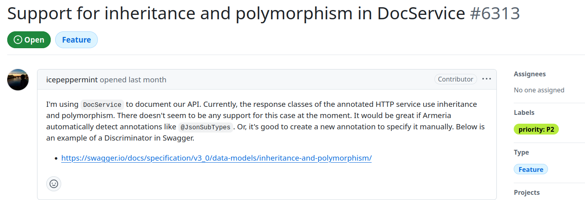
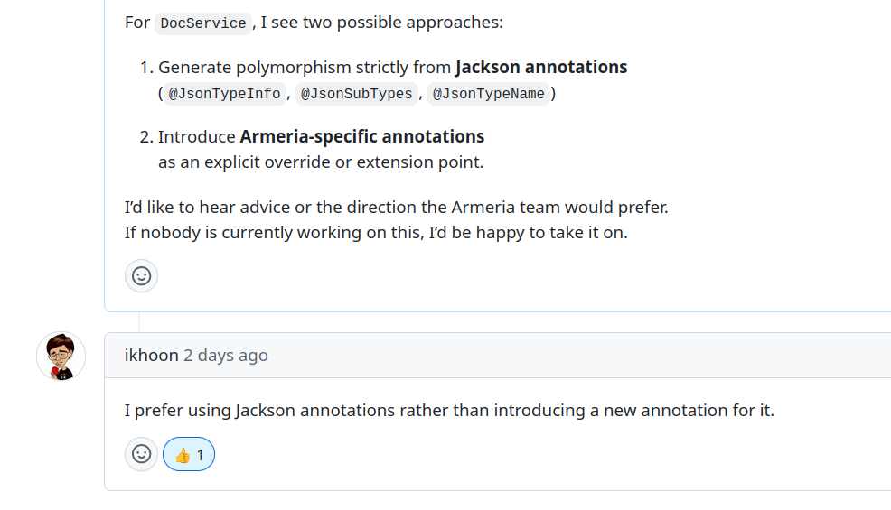
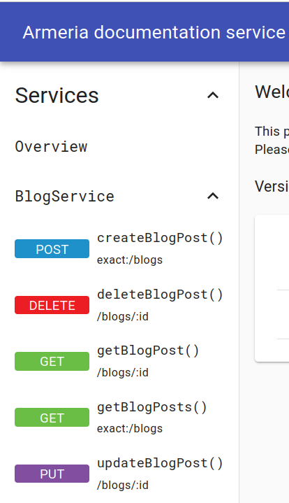
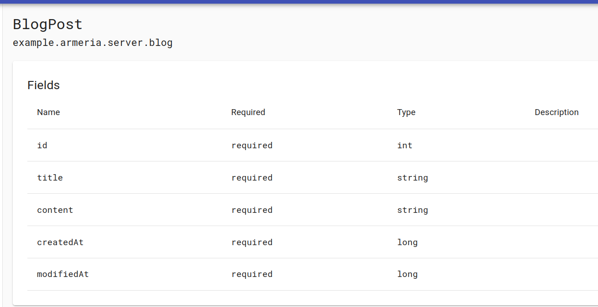
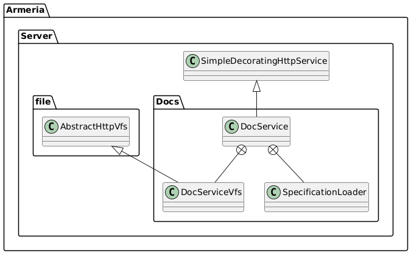
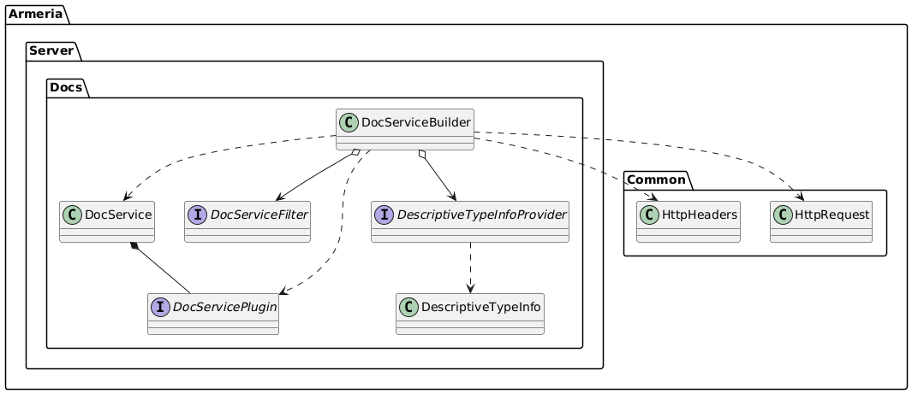

### 배경

[Armeria](https://github.com/line/armeria)라는 프로젝트에 기여하기위해 이슈를 찾아보던 중, 다음과 같은 이슈를 발견했다.

[#6313이슈](https://github.com/line/armeria/issues/6313)


<p style="text-align: center;">
  
</p>

어떤 내용일까 싶어서 찾아보니 DocService라는 문서생성 총괄 클래스에 상속과 다형성을 추가해달라는 의미로 이해하여 기여를 해보기로 했다. 


<p style="text-align: center;">
  
</p>


---
### Armeria의 특징

Armeria는 **어떠한 상황** 에서도 사용가능하도록 REST, gRPC, thrift와 같은 네트워크 프로토콜과 spring, dropwizard라는 프레임워크, java, kotlin, scala와 같은 프로그래밍 언어 등등 상살할 수 있는 거의 모든 기술을 통합한 프레임워크다. Armeria를 사용하여 간단한 blogService application을 만들때, 다음과 같이 시작할 수 있다.

``` java
public final class Main {

    private static final Logger logger = LoggerFactory.getLogger(Main.class);

    public static void main(String[] args) throws Exception {
        final Server server = newServer(8080);

        server.closeOnJvmShutdown();

        server.start().join();

        logger.info("Server has been started. Serving DocService at http://127.0.0.1:{}/docs",
                    server.activeLocalPort());
    }
   
    static Server newServer(int port) {
        final ServerBuilder sb = Server.builder();
        final DocService docService = //서버에 붙이는 DocService도 빌더패턴으로 붙여 제작
                DocService.builder()
                          .exampleRequests(BlogService.class,
                                           "createBlogPost",
                                           "{\"title\":\"My first blog\", \"content\":\"Hello Armersssia!\"}")
                          .build();
        return sb.http(port) //서버에 서비스를 빌더패턴으로 붙여서 제작.
                 .annotatedService(new BlogService())
                 .serviceUnder("/docs", docService)
                 .build();
    }
}

```

여기서 사용자는 BlogService와 같은 본인의 도메인이 담긴 서비스를 제작하고 **ServerBuilder** 를 통해 메소드 체이닝을 하면서 간단하게 서비스를 붙이고, DocService와 같은 부가기능을 추가해나갈 수 있다.


### DocService란?

내가 기여하고자 하는 이 DocService는 사용자가 제작한 서비스의 네트워크 프로토콜(REST, gRPC, thrift)을 가리지 않고, Swagger-ui처럼 자동으로 문서화를 해주는 클래스다. REST의 예시 화면은 다음과 같다.


<p style="text-align: center;">
  
</p>

<p style="text-align: center;">
  
</p>

어느정도 각 API엔드포인트의 경로와 객체 속성정보를 보여주지만, 상속과 다형성에 관련된 정보가 없어서 이번에 기여해보고자 한다.

#### DocService 코드
이 DocService의 클래스다이어그램을 통해 주변 class, interface를 살펴보면 원리를 이해하기 쉽다.


<p style="text-align: center;">
  
</p>

<p style="text-align: center;">
  
</p>

DocService라는 객체는 사용자가 개발한 API서버의 정보를 받아 문서화를 진행하는 대표 클래스이다. DocService 는 **Builder패턴** 으로 구성될 수 있는데, 이때 DocServiceBuilder가 DescriptiveTypeInfoProvider의 구현체를 입력받아 사용할 수 있다. 

``` java
// DocServiceBuilder.java

 /**
     * Adds the specified {@link DescriptiveTypeInfoProvider}s used to create a {@link DescriptiveTypeInfo} from
     * a type descriptor.
     */
      @UnstableApi
    public DocServiceBuilder descriptiveTypeInfoProvider(
            DescriptiveTypeInfoProvider descriptiveTypeInfoProvider) {
        requireNonNull(descriptiveTypeInfoProvider, "descriptiveTypeInfoProvider");
        if (this.descriptiveTypeInfoProvider == null) {
            this.descriptiveTypeInfoProvider = descriptiveTypeInfoProvider;
        } else {
            this.descriptiveTypeInfoProvider.orElse(descriptiveTypeInfoProvider);
        }
        return this;
    }

    //....
```


```java
//DocService.java

public final class DocService extends SimpleDecoratingHttpService {
    //...
    static final List<DocServicePlugin> plugins = ImmutableList.copyOf(ServiceLoader.load(
            DocServicePlugin.class, DocService.class.getClassLoader()));

    static final List<DescriptiveTypeInfoProvider> SPI_DESCRIPTIVE_TYPE_INFO_PROVIDERS =
            ImmutableList.copyOf(ServiceLoader.load(
                    DescriptiveTypeInfoProvider.class, DocService.class.getClassLoader()));
                    //...
}

```
DocService는 Java의 SPI를 이용해 DocServicePlugin과 DescriptiveTypeInfoProvider의 구현체를 읽어오는데, 상당히 흥미로운 기술이라 다음에 기회가 된다면 포스팅할 계획이다.

한편, DescriptiveTypeInfoProvider의 경우, DocServiceBuilder를 통해 입력받을 수도 있고, SPI를 통해 자동으로 가져올 수도 있는데, 이에 대한 우선순위 설정이 존재한다.


```java
//DocService.java

public final class DocService extends SimpleDecoratingHttpService {
    //...
    static final class SpecificationLoader {
        //...
                private static DescriptiveTypeInfoProvider composeDescriptiveTypeInfoProvider(
                @Nullable DescriptiveTypeInfoProvider descriptiveTypeInfoProvider) {
            
            return typeDescriptor -> {
                if (descriptiveTypeInfoProvider != null) {
                    // Respect user-defined provider first.
                    final DescriptiveTypeInfo descriptiveTypeInfo =
                            descriptiveTypeInfoProvider.newDescriptiveTypeInfo(typeDescriptor);
                    if (descriptiveTypeInfo != null) {
                        return descriptiveTypeInfo;
                    }
                } //사용자가 Builder로 주입한 Provider를 우선 사용한다. 만약 null이 나온다면..

                for (DescriptiveTypeInfoProvider provider : SPI_DESCRIPTIVE_TYPE_INFO_PROVIDERS) {
                    final DescriptiveTypeInfo descriptiveTypeInfo =
                            provider.newDescriptiveTypeInfo(typeDescriptor);
                    if (descriptiveTypeInfo != null) {
                        return descriptiveTypeInfo;
                    }
                } //사용자 설정 Provider가 없다면 SPI로 가져온 Provider를 사용한다.
                return null;
            };
        }
    }
    }
}
```


---

DocService는 **문서 작성** 이라는 작업을 총괄하고, 각 구현체에게 명령하는 클래스이다. 그래서 실질적으로 어떤 코드를 무엇을 기준으로 읽어오고 어떻게 구성할지에 대한 실질적이고 구체적인 로직을 갖고있지 않다. (=인터페이스를 참조하여 객체지향적으로 개발되어있다.)

DocService에게 명령을 받아 구체적인 작업을 진행하는 인터페이스는 다음과 같다.

1. **DocServicePlugin** / interface
    - 
    - 특정 기능을 제공하는 전문 기능, 예를들어, gRPCPlugin이라면 DocService는 gRPC가 뭔지 몰라도 이 gRPCSerivcePlugin을 불러와서 일을 시킨다. 


2. **DescriptiveTypeInfoProvider** / interface
    -
    -특정 데이터타입을 어떻게 문서로 표현할지 상세한 정보를 제공하는(provide) 인터페이스, --Plugin들이 큰 구조를 잡다가 특이한 객체같은걸 만나면 이 Provider에게 물어본다. 
    

3. **DocServiceFilter** / interface
    -
    - 서비스를 생설할 때 어떤 메소드를 문서에 포함시키고, 제외시킬지 고르는 말 그대로의 필터 역할.

4. **ServiceSpecification** / class
    -
    - --Plugin, --Provider, --filter들이 작업을 마치고 생성하는 최종 문서화 산물. DocService는 이 상세 명세를 받고 UI가 읽을 수 있는 Json으로 변환함.

<br>
<br>

---

### 앞으로의 계획

앞으로 Jackson의 애노테이션을 가지고 상속과 다형성 기능을 구현해야 하는데, --Provider를 중심으로 작업을 생각중이다. 


