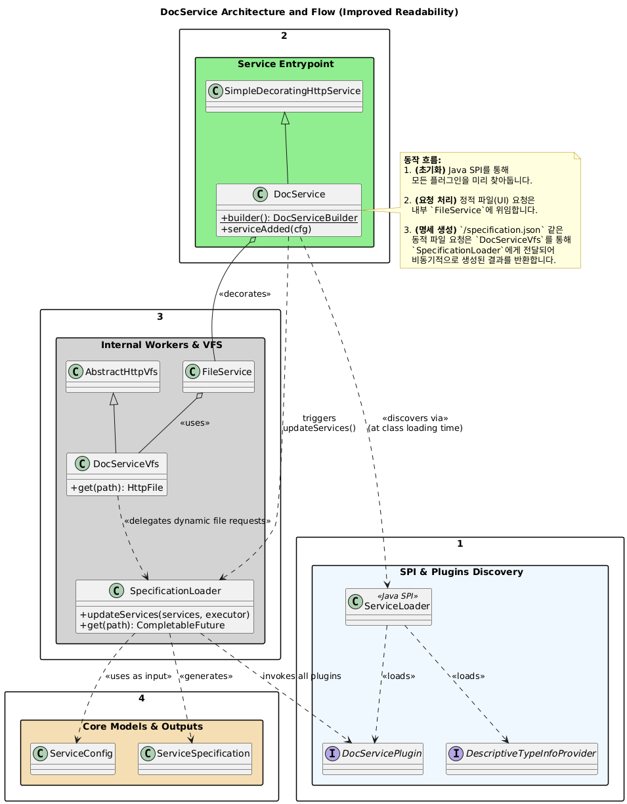
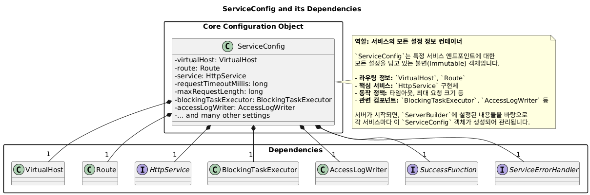
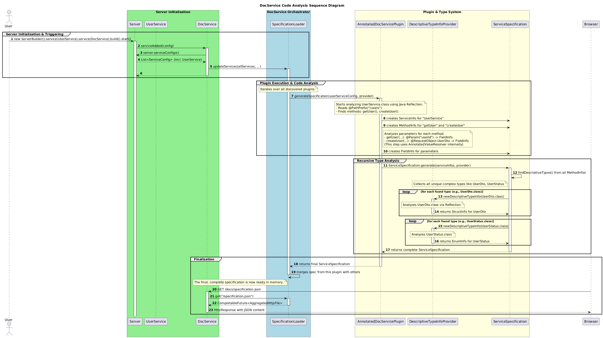
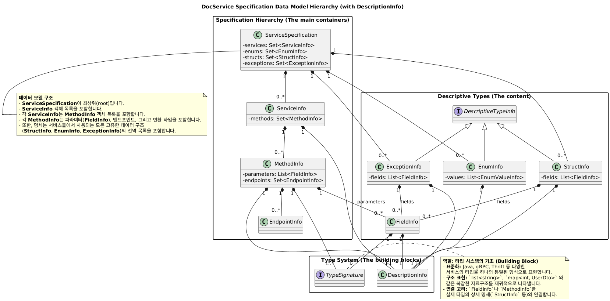
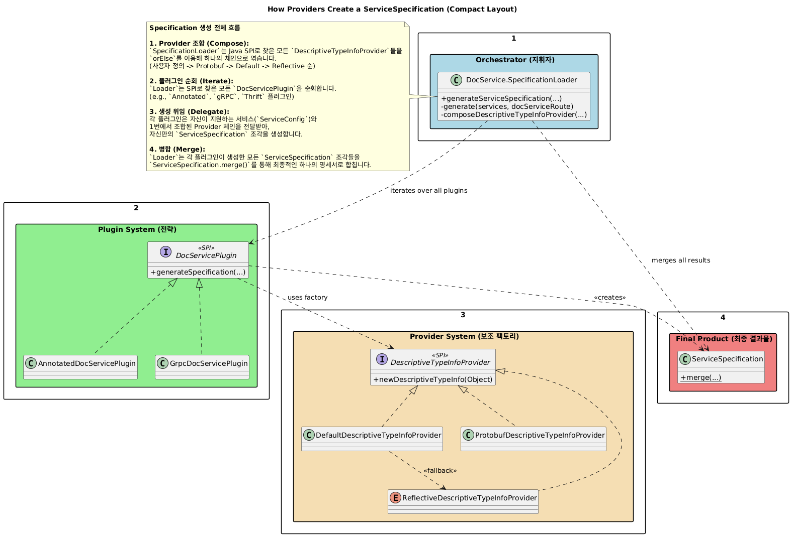
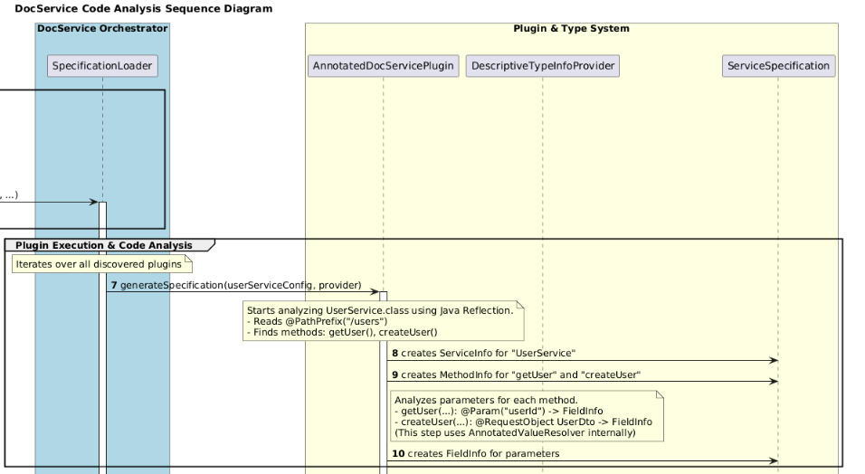

### 지난 포스팅

[지난 포스팅 : Armeria DocService 구조 이해 ](https://younghoney.github.io/posts/Armeria(1)/)


지난 포스팅에서 Armeria 프로젝트에 대한 간략한 소개와 DocService에 대한 개략적인 설명이 있었다. 현 시점엔 기능구현은 얼추 마치고 PR_DRAFT로 올려놨는데, 여기까지 오기에 앞서 코드를 분석했던 내용을 정리하기로 했다.


---
### DocService의 시작

 Armeria를 사용하여 간단한 blogService application을 만들때, 다음과 같이 시작할 수 있다.

``` java
public final class Main {

    private static final Logger logger = LoggerFactory.getLogger(Main.class);

    public static void main(String[] args) throws Exception {
        final Server server = newServer(8080);

        server.closeOnJvmShutdown();

        server.start().join();

        logger.info("Server has been started. Serving DocService at http://127.0.0.1:{}/docs",
                    server.activeLocalPort());
    }
   
    static Server newServer(int port) {
        final ServerBuilder sb = Server.builder();
        final DocService docService = //서버에 붙이는 DocService도 빌더패턴으로 붙여 제작
                DocService.builder()
                          .exampleRequests(BlogService.class,
                                           "createBlogPost",
                                           "{\"title\":\"My first blog\", \"content\":\"Hello Armersssia!\"}")
                          .build();
        return sb.http(port) //서버에 서비스를 빌더패턴으로 붙여서 제작.
                 .annotatedService(new BlogService()) //AnnotatedDocServicePlugin 사용 예상
                 .serviceUnder("/docs", docService)
                 .build();
    }
}


//---  아래는 예시 BlogService, 구현부분은 생략


public final class BlogService {

    private final Map<Integer, BlogPost> blogPosts = new ConcurrentHashMap<>();

    @Post("/blogs")
    @RequestConverter(BlogPostRequestConverter.class)
    public HttpResponse createBlogPost(BlogPost blogPost) {
    }
    @Get("/blogs/:id")
    public HttpResponse getBlogPost(@Param int id) {
    }

    /**
     * Retrieves all {@link BlogPost}s created so far in the reverse chronological order .
     */
    @Get("/blogs")
    @ProducesJson
    public Iterable<BlogPost> getBlogPosts(@Param @Default("true") boolean descending) {
    }


    @Put("/blogs/:id")
    public HttpResponse updateBlogPost(@Param int id, @RequestObject BlogPost blogPost) {
    }

    @Blocking
    @Delete("/blogs/:id")
    @ExceptionHandler(BadRequestExceptionHandler.class)
    public HttpResponse deleteBlogPost(@Param int id) {
    }
}

//--- 아래는 BlogPost 엔티티, 구현부분은 생략
public final class BlogPost {
    private final int id;
    private final String title;
    private final String content;
    private final long createdAt;
    private final long modifiedAt;

    @JsonCreator
    BlogPost(@JsonProperty("id") int id, @JsonProperty("title") String title,
             @JsonProperty("content") String content) {
    }

    BlogPost(int id, String title, String content, long createdAt) {
        this(id, title, content, createdAt, createdAt);
    }

    BlogPost(int id, String title, String content, long createdAt, long modifiedAt) {
    }

    public int getId() {
        return id;
    }

    public String getTitle() {
        return title;
    }

    public String getContent() {
        return content;
    }

    public long getCreatedAt() {
        return createdAt;
    }

    public long getModifiedAt() {
        return modifiedAt;
    }
}


```

# 1 DocService

<p style="text-align: center;">
  
</p>

DocService의 역할을 요약하면 다음과 같다.
> API 엔드포인트 문서 작성을 위해 UI에게 전달할 **JSON**  제작.

DocService는 JSON양식이 될 ServiceSpecification제작을 목표로 SPI를 통해 사용자가 추가하거나 기본으로 설정된 XXXPlugin과 XXXProvider들을 불러온다.


``` java
// DocService.java
static final List<DocServicePlugin> plugins = ImmutableList.copyOf(ServiceLoader.load(
DocServicePlugin.class, DocService.class.getClassLoader()));

static final List<DescriptiveTypeInfoProvider> SPI_DESCRIPTIVE_TYPE_INFO_PROVIDERS =
ImmutableList.copyOf(ServiceLoader.load(
DescriptiveTypeInfoProvider.class, DocService.class.getClassLoader()));
```

이러한 Plugin과 Provider들은 static final로 선언되어있어 DocService의 다른 로직이 실행되기 이전에 SPI메커니즘을 통해 불러와 저장된다. 

XXXPlugin의 예시로 AnnoatedDocServicePlugin, GrpcDocServicePlugin, ThriftDocServicePlugin들이 있는데, 간단히 설명하자면 ServiceSpecification을 만들기위해 각 분야에 걸맞은 도구 모음집이라고 생각하면 된다. 이번 contribute의 경우 gRPC, thrift와는 관련이 크게 없어 AnnotatedDocServicePlugin쪽을 주로 살펴봤다.


## 1-1: DocService가 어떻게 다른 서비스(비즈니스로직) 정보를 받아올까?

DocService는 서버에 등록된 서비스의 정보를 받아와 어떤 엔드포인트에 어떤 메소드가 있고, 이것에 대한 설명, 입력값, 출력값
등등에 대한 정보, 그리고 서비스에 사용되는 엔티티들이 어떻게 생겼고 어떤 매개변수를 지니고 어떤 설명이 필요한지 그 정보들을 
알아야 한다. 

앞서 Main.java코드에서 ServerBuilder sb가 .build()를 호출하는 순간. **ServiceConfig** 라는 객체가 생성된다.
> 여기서 쓰이는 Service는 DocService와 같이 Armeria내부 코드가 아니라 PetService와 같은 비즈니스 로직의 서비스를 말한다.

``` java
    /**
     * Returns a newly-created {@link Server} based on the configuration properties set so far.
     */
    public Server build() {
        final Server server = new Server(buildServerConfig(ports));
        serverListeners.forEach(server::addListener);
        return server;
    }
```

<p style="text-align: center;">
  
</p>


`build()` 시점에 서버에 등록된 모든 서비스에 대한 `ServiceConfig` 객체들이 생성되어 `Server` 내부에 보관된다. 즉, API 문서화의 대상이 될 수 있는 모든 서비스의 "명단"이 이 시점에 확정되는 것이다.

그렇다면 `DocService`는 이 명단을 어떻게 전달받을까? 그 열쇠는 바로 Armeria 서버의 생명주기(Lifecycle)에 있다.

`DocService` 는 추상클래스인 `SimpleDecoratingHttpService`의 서브클래스이고 이 추상클래스는 `HttpService` 인터페이스를 구현한다. 서버가 시작되기 직전 `serviceAdded(ServiceConfig cfg)`라는 메서드가 호출된다. 이 메서드는 `DocService`에게 "당신은 이제 이 서버의 일원입니다. 이것은 당신의 계약서(`ServiceConfig`)입니다"라고 알려주는 신호와 같다.

> 앞서 Main.java에서 Server가 빌더패턴을 이용해 DocService를 **붙이는** 작업을 진행했는데 Armeria의 특장점 중 하나로 개발자가 특정기능을 원할때마다 자유롭게 붙여나가면서 각 Service마다 serviceAdded가 호출되는 것이다.


## 1-2: DocService, ServiceSpecification 작성을 시작하다.

<p style="text-align: center;">
  
</p>

DocService가 ServiceSpecification을 생성하고 반환하는 과정은 크게 위의 이미지와 같다. 앞으로 이 머나먼 과정을 한번 떠나보자.


```java
// DocService.java
@Override
public void serviceAdded(ServiceConfig cfg) throws Exception {
    super.serviceAdded(cfg);

    // ...

    // serviceAdded를 통해 전달받은 cfg로부터 Server 객체 전체에 대한 참조를 얻는다.
    server = cfg.server();

    // 서버 객체를 통해 서버에 등록된 모든 서비스의 ServiceConfig 목록을 가져온다.
    final List<ServiceConfig> services = server.config().serviceConfigs();
    
    // ... 이 'services' 목록을 가지고 실제 문서 생성 작업을 시작한다.
    vfs().specificationLoader.updateServices(services, ...);
}
```

위 코드의 흐름을 정리하면 다음과 같다.
1.  서버가 빌드될 때 모든 서비스에 대한 `ServiceConfig` 목록이 완성된다.
2.  서버가 시작되면서 `DocService`의 `serviceAdded`가 호출된다.
3.  `DocService`는 전달받은 자신의 `ServiceConfig`를 통해 `Server` 객체에 접근한다.
4.  `Server` 객체를 통해 1번에서 만들어진 **전체 `ServiceConfig` 목록**을 마침내 손에 넣는다.
5.  이 목록을 내부의 `SpecificationLoader`에게 전달하여, 비로소 API 명세 생성을 위한 긴 여정을 시작하게 된다.

## 1-3: DocService.SpecificationLoader, 문서 명세 실무담당.

DocSerivce가 반환해야 할 ServiceSpecification의 구조와, 프로세스 전반의 처리 구조는 다음과 같다. 아직 설명하지 못한 부분도 있어서 그냥 단순히 이렇게 생겼구나 하면서 이해하면 편할것이다.

<p style="text-align: center;">
  
</p>


<p style="text-align: center;">
  
</p>

<br>
<br>

다소 어지럽게 UML이 되어있는데, ServiceSpecification은 다수의 XXXInfo라는 객체들로 구성되어있고 이런 XXXInfo객체들을 생성하기위해 DocService가 SPI로 XXXPlugin, XXXTypeInfoProvider를 받아온거라고 보면 된다.


<p style="text-align: center;">
  
</p>


``` java

//DocService.java의 내부클래스 SpecificationLoader 내부 메소드
 CompletableFuture<List<AggregatedHttpFile>> updateServices(List<ServiceConfig> services,
                                                                   Route docServiceRoute,
                                                                   Executor executor) {
            this.services = services;

            final CompletableFuture<ServiceSpecification> serviceSpecificationFuture =
                    generateServiceSpecification(executor, docServiceRoute);
//...나머지 부분 생략

private CompletableFuture<ServiceSpecification> generateServiceSpecification(Executor executor,
                                                                                     Route docServiceRoute) {
    return CompletableFuture.supplyAsync(() -> {
        final DocStringSupport docStringSupport = new DocStringSupport(services);
        ServiceSpecification spec = generate(services, docServiceRoute); //1-4 다음 목차
        spec = docStringSupport.addDocStrings(spec); 
        spec = exampleSupport.addExamples(spec); 
        return spec;
    }, executor);
}
```

그렇게 serviceAdded가 호출되고, `SpecificationLoader`로 그 공이 넘어왔다. 이제 메소드를 보는데

`CompletableFuture` 라는 다소 생소한 객체가 나오고, Async가 나와서 관련 내용을 찾아보니 비동기와 관련된 코드였다.

Armeria는 왜 이 복잡해 보이는 비동기 방식을 사용했을까? 그 이유는 **서버 시작 성능** 때문이다. API 문서 생성은 서비스가 많을 경우 수 초가 걸릴 수 있는 무거운 작업이다. 만약 이 작업을 동기적으로 처리한다면, 문서 생성이 끝날 때까지 서버는 다른 요청을 전혀 받지 못하고 멈춰있게 된다.

`CompletableFuture.supplyAsync`는 이 문제를 해결한다. 이 코드는 "문서 생성이라는 오래 걸리는 작업은 저기 백그라운드 스레드(`executor`)에게 시켜놓고, 나는 일단 '작업 완료 증명서(`CompletableFuture`)'만 받아서 즉시 다음 일을 하러 갈게!" 라는 의미이다. 덕분에 서버는 지연 없이 빠르게 시작될 수 있다.

그렇다면 백그라운드 스레드가 실행하는 실제 작업은 무엇일까? `supplyAsync`의 람다 함수 내부를 들여다보면 명세서가 완성되는 3단계 파이프라인을 볼 수 있다.

1.  **설명 수집 (`new DocStringSupport(services)`)**: 가장 먼저 `DocStringSupport` 객체를 생성한다. 이 과정에서 모든 플러그인의 `loadDocStrings()`가 호출되어, 소스 코드 주석 등에서 모든 설명 정보를 미리 긁어모아 "설명 사전"을 구축한다.

2.  **뼈대 생성 (`generate(services, docServiceRoute)`)**: 다음으로 `SpecificationLoader`의 `generate` 헬퍼 메서드를 호출한다. 이 메서드는 모든 플러그인의 `generateSpecification()`을 호출하여, 각 서비스의 구조 정보를 담은 `ServiceSpecification` "조각"들을 만들고, 이를 하나로 합쳐 거대한 "뼈대 명세서"를 완성한다. 이 뼈대에는 아직 설명이 비어있다.

3.  **살 붙이기 (`.addDocStrings`, `.addExamples`)**: 마지막으로, 1번에서 만들어 둔 "설명 사전"을 이용해 2번에서 만든 뼈대의 비어있는 설명 부분을 채워 넣는다. 그리고 사용자가 설정한 예제 정보도 함께 추가하여 최종 `ServiceSpecification`을 완성한다.

## 1-4 DocService.SpecificationLoader.generate: 전문가(Plugin)와 일감(Service)의 매핑

```java
private ServiceSpecification generate(List<ServiceConfig> services, Route docServiceRoute) {
    return ServiceSpecification.merge(
            plugins.stream()
                   .map(plugin -> plugin.generateSpecification(
                           findSupportedServices(plugin, services),
                           filter, descriptiveTypeInfoProvider))
                   .collect(toImmutableList()), docServiceRoute);
}
```


``` java

//DocService.java

static Set<ServiceConfig> findSupportedServices (DocServicePlugin plugin, List<ServiceConfig> services) {

     final Set<Class<? extends Service<?, ?>>> supportedServiceTypes = plugin.supportedServiceTypes();

     return services.stream().filter(serviceCfg -> isSupported(serviceCfg, supportedServiceTypes))
                    .collect(toImmutableSet());

}

private static boolean isSupported(ServiceConfig serviceCfg, Set<Class<? extends Service<?, ?>>> supportedServiceTypes) {

return supportedServiceTypes.stream().anyMatch(type -> serviceCfg.service().as(type) != null);
}

// AnnotatedDocServicePlugin.java
@Override
public Set<Class<? extends Service<?, ?>>> supportedServiceTypes() {
return ImmutableSet.of(AnnotatedService.class);
}

``` 

`SpecificationLoader`의 `generate` 메서드는 SPI를 통해 로드된 모든 플러그인을 지휘하여 API 명세서의 뼈대를 만드는 핵심부다. 이 코드는 스트림 API를 통해 다음의 3단계 작업을 순차적으로 수행한다.

### 1-4-1. 전문가(Plugin) 순회
`plugins.stream()`을 통해 `AnnotatedDocServicePlugin`, `GrpcDocServicePlugin` 등 SPI로 찾아낸 모든 전문가 목록을 가져와 작업을 시작한다.

### 1-4-2. 전문가와 일감의 지능적인 매핑
`.map(...)` 내부의 `findSupportedServices(plugin, services)`가 가장 중요한 역할을 한다. `SpecificationLoader`는 각 전문가에게 일을 시키기 전, 다음과 같은 "면접"을 통해 전문 분야에 맞는 일감만 정확히 전달한다.

1.  **자격 요건 확인**: 플러그인에게 `supportedServiceTypes()`를 호출하여 어떤 종류의 서비스(`AnnotatedService.class` 등)를 처리할 수 있는지 묻는다.
2.  **지원자 검증**: 서버에 등록된 모든 서비스(`ServiceConfig`)를 순회하며, 각 서비스의 실제 객체(`serviceCfg.service()`)가 플러그인이 제시한 자격 요건에 부합하는지 `as(type)` 메서드로 확인한다.
3.  **일감 할당**: 이 면접을 통과한 서비스들만 필터링하여 해당 전문가 플러그인의 `generateSpecification()` 메서드로 전달한다.

이러한 매핑 과정 덕분에 각 플러그인은 자신이 처리할 수 없는 불필요한 서비스 정보는 받지 않고, 자신의 전문 분야에만 집중하여 `ServiceSpecification` "조각"을 효율적으로 생성할 수 있다.

### 1-4-3. 결과물 취합 및 조립
모든 플러그인이 각자의 "조각"을 완성하면, `collect`를 통해 이들을 하나의 리스트로 모은 뒤 `ServiceSpecification.merge()`를 호출하여 하나의 거대하고 완전한 **"뼈대 명세서"**로 최종 조립한다.
<br>
<br>

## (다음 포스팅) 1-5 XXXplugin.generateSpecification
이제 ServiceSpecification을 생성하기위해, 지금 작성한 서비스에 걸맞는 처리기(XXXPlugin)들에 작업을 요청하고, 이것들이 처리하고 ServiceSpecification을 반환하는 것을 다음에 살펴보도록 하겠다.