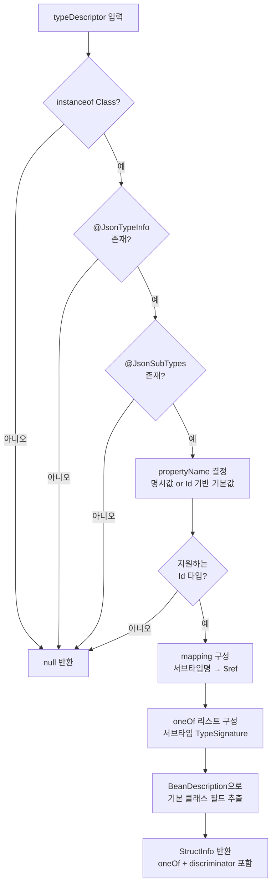

### 지난 포스팅

[Armeria(1): DocService 구조 이해](https://younghoney.github.io/posts/Armeria(1)/)  
[Armeria(2): DocService 코드 상세분석](https://younghoney.github.io/posts/Armeria(2)/)

Armeria(1)에서 DocService 구조를 살펴보며 이런 말로 끝맺었다.

> "앞으로 Jackson의 애노테이션을 가지고 상속과 다형성 기능을 구현해야 하는데, `--Provider`를 중심으로 작업을 생각 중이다."

드디어 그 이야기를 할 차례다. 이 포스팅부터는 실제 **구현** 이야기다.

---

### 문제: DocService는 다형성을 모른다

다음과 같이 Jackson 다형성 어노테이션이 달린 클래스가 있다고 하자.

```java
@JsonTypeInfo(use = JsonTypeInfo.Id.NAME, include = JsonTypeInfo.As.PROPERTY, property = "species")
@JsonSubTypes({
    @JsonSubTypes.Type(value = Dog.class, name = "dog"),
    @JsonSubTypes.Type(value = Cat.class, name = "cat")
})
public abstract class Animal {
    private String name;
}

public class Dog extends Animal {
    private String breed;
}

public class Cat extends Animal {
    private boolean isIndoor;
}
```

그리고 이 `Animal`을 반환하는 API가 있다면:

```java
@Get("/animal/:id")
@ProducesJson
public Animal getAnimal(@Param int id) { ... }
```

기존 DocService에서는 이 API를 어떻게 문서화할까?

**[DocService에서 다형성 타입이 표시되지 않는 스크린샷을 첨부해주세요. PR 이전 상태의 DocService 화면입니다.]**

`Dog`, `Cat`이라는 서브타입의 존재도, 어떤 필드로 타입을 구분하는지도 알 수 없었다. `Animal`이라는 추상 클래스 자체의 정보만 노출될 뿐이었다. 이게 이슈 [#6313](https://github.com/line/armeria/issues/6313)이 제기한 문제다.

---

### 해결 아이디어: `DescriptiveTypeInfoProvider`를 구현하자

Armeria(1)에서 살펴봤듯이, DocService에는 특정 타입에 대한 상세 정보를 제공하는 `DescriptiveTypeInfoProvider` 인터페이스가 있다.

```java
public interface DescriptiveTypeInfoProvider {
    @Nullable
    DescriptiveTypeInfo newDescriptiveTypeInfo(Object typeDescriptor);
}
```

`typeDescriptor`로 들어오는 `Class` 객체에 `@JsonTypeInfo`와 `@JsonSubTypes`가 달려 있으면, 그 정보를 읽어 다형성 메타데이터를 담은 `StructInfo`를 반환하면 된다. Provider가 `null`을 반환하면 DocService는 "이 타입은 모른다"고 판단해서 다음 Provider로 넘어간다.

---

### OpenAPI discriminator: 어떻게 표현할 것인가

구현에 앞서 이 다형성 정보를 어떻게 **표현**할지 정해야 했다. 참조한 것은 OpenAPI Specification의 discriminator 개념이다.

OpenAPI 3.0은 다형성을 다음과 같이 표현한다.

```json
{
  "oneOf": [
    { "$ref": "#/$defs/models/com.example.Dog" },
    { "$ref": "#/$defs/models/com.example.Cat" }
  ],
  "discriminator": {
    "propertyName": "species",
    "mapping": {
      "dog": "#/$defs/models/com.example.Dog",
      "cat": "#/$defs/models/com.example.Cat"
    }
  }
}
```

`oneOf`는 가능한 서브타입 목록이고, `discriminator`는 어떤 필드로 타입을 구분하는지(`propertyName`)와 그 값→스키마 매핑(`mapping`)을 담는다. Armeria에서도 이 구조를 따라가기로 했다.

---

### `DiscriminatorInfo`: discriminator 정보를 담는 데이터 클래스

`discriminator`에 해당하는 데이터를 담기 위해 `DiscriminatorInfo` 클래스를 새로 만들었다.

```java
@UnstableApi
public final class DiscriminatorInfo {

    public static DiscriminatorInfo of(String propertyName, Map<String, String> mapping) {
        return new DiscriminatorInfo(propertyName, mapping);
    }

    private final String propertyName;
    private final Map<String, String> mapping;

    DiscriminatorInfo(String propertyName, Map<String, String> mapping) {
        this.propertyName = requireNonNull(propertyName, "propertyName");
        this.mapping = ImmutableMap.copyOf(requireNonNull(mapping, "mapping"));
    }

    @JsonProperty
    public String propertyName() {
        return propertyName;
    }

    // mapping: "dog" -> "#/$defs/models/com.example.Dog" 형태
    @JsonProperty
    public Map<String, String> mapping() {
        return mapping;
    }
}
```

간단한 불변 데이터 클래스다. `propertyName`은 `"species"`처럼 페이로드에서 타입을 구분하는 필드명이고, `mapping`은 `"dog" → "#/$defs/models/com.example.Dog"` 형태의 매핑이다.

이와 함께 `StructInfo`에 `oneOf`와 `discriminator` 필드를 추가했다.

```java
public final class StructInfo implements DescriptiveTypeInfo {
    // 기존 필드들 ...

    private final List<TypeSignature> oneOf;       // 서브타입 목록
    @Nullable
    private final DiscriminatorInfo discriminator; // 구분자 정보
}
```

---

### `JacksonPolymorphismTypeInfoProvider` 구현

이제 핵심 구현 클래스다. `DescriptiveTypeInfoProvider`를 구현해서, 넘어온 `Class`에 Jackson 어노테이션이 있으면 위에서 정의한 다형성 정보를 채워 반환한다.

```java
public final class JacksonPolymorphismTypeInfoProvider implements DescriptiveTypeInfoProvider {

    private static final ObjectMapper mapper = JacksonUtil.newDefaultObjectMapper();

    @Override
    @Nullable
    public DescriptiveTypeInfo newDescriptiveTypeInfo(Object typeDescriptor) {
        requireNonNull(typeDescriptor, "typeDescriptor");
        if (!(typeDescriptor instanceof Class)) {
            return null;
        }

        final Class<?> clazz = (Class<?>) typeDescriptor;
        final JsonTypeInfo jsonTypeInfo = clazz.getAnnotation(JsonTypeInfo.class);
        final JsonSubTypes jsonSubTypes = clazz.getAnnotation(JsonSubTypes.class);

        if (jsonTypeInfo == null || jsonSubTypes == null) {
            return null;
        }

        // --- 1단계: propertyName 결정 ---
        String propertyName = jsonTypeInfo.property();
        if (propertyName.isEmpty()) {
            final JsonTypeInfo.Id use = jsonTypeInfo.use();
            if (use == JsonTypeInfo.Id.CLASS) {
                propertyName = "@class";
            } else if (use == JsonTypeInfo.Id.MINIMAL_CLASS) {
                propertyName = "@c";
            } else if (use == JsonTypeInfo.Id.NAME || use == JsonTypeInfo.Id.SIMPLE_NAME) {
                propertyName = "@type";
            } else {
                return null;
            }
        }

        if (jsonSubTypes.value().length == 0) {
            return null;
        }

        // --- 2단계: mapping 구성 ---
        final Map<String, String> mapping = new LinkedHashMap<>();
        Arrays.stream(jsonSubTypes.value()).forEach(subType -> {
            final Class<?> subClass = subType.value();
            final String key = isNullOrEmpty(subType.name()) ? subClass.getSimpleName() : subType.name();
            final String schemaName = TypeSignature.ofStruct(subClass).name();
            mapping.put(key, "#/$defs/models/" + schemaName);
        });

        final DiscriminatorInfo discriminator = DiscriminatorInfo.of(propertyName, mapping);

        // --- 3단계: oneOf 리스트 구성 ---
        final List<TypeSignature> oneOf = Arrays.stream(jsonSubTypes.value())
                                                .map(subType -> TypeSignature.ofStruct(subType.value()))
                                                .collect(toImmutableList());

        // --- 4단계: 기본 클래스 필드 추출 ---
        final JavaType javaType = mapper.constructType(clazz);
        final BeanDescription description = mapper.getSerializationConfig().introspect(javaType);
        final List<BeanPropertyDefinition> properties = description.findProperties();

        final List<FieldInfo> fields = properties.stream()
                                                 .map(prop -> FieldInfo.of(prop.getName(),
                                                                           toTypeSignature(prop.getPrimaryType())))
                                                 .collect(toImmutableList());

        // --- 5단계: 클래스 설명 추출 ---
        final Description classDescription = clazz.getAnnotation(Description.class);
        final DescriptionInfo descriptionInfo = classDescription == null
                ? DescriptionInfo.empty()
                : DescriptionInfo.from(classDescription);

        return new StructInfo(clazz.getName(), null, fields, descriptionInfo, oneOf, discriminator);
    }
}
```

단계별로 살펴보자.

#### 1단계: propertyName 결정

`@JsonTypeInfo`의 `property` 속성이 명시된 경우(예: `property = "species"`)는 그대로 쓴다. 명시되지 않은 경우 Jackson의 기본값을 따른다.

| `use` 값 | 기본 propertyName |
|---|---|
| `Id.CLASS` | `@class` |
| `Id.MINIMAL_CLASS` | `@c` |
| `Id.NAME` / `Id.SIMPLE_NAME` | `@type` |
| 그 외 | 미지원 (`null` 반환) |

#### 2단계: mapping 구성

```java
@JsonSubTypes.Type(value = Dog.class, name = "dog")
```

`name`이 명시된 경우 그것을 키로 쓰고, 없으면 `Dog.getSimpleName()` = `"Dog"`을 키로 쓴다. 값은 JSON Schema 참조 형식인 `"#/$defs/models/com.example.Dog"`.

#### 3단계: oneOf 리스트

`@JsonSubTypes`의 `value` 배열에서 서브타입 클래스들을 `TypeSignature.ofStruct()`로 변환한다. 이것이 JSON Schema의 `oneOf` 배열로 이어진다.

#### 4단계: 기본 클래스 필드 추출

```java
final BeanDescription description = mapper.getSerializationConfig().introspect(javaType);
final List<BeanPropertyDefinition> properties = description.findProperties();
```

`getDeclaredFields()`로 직접 reflection하지 않고 Jackson의 `BeanDescription`을 쓴 것이 포인트다. 이렇게 하면 `@JsonIgnore`, `@JsonProperty(access = READ_ONLY)` 같은 어노테이션도 모두 반영된 **"Jackson이 실제로 직렬화하는 속성"** 목록을 얻는다.

---

### 전체 흐름 다이어그램



---

### 제약사항

현재 구현은 `@JsonTypeInfo(include = As.PROPERTY)` 또는 `EXISTING_PROPERTY`만 지원한다. 페이로드 안에 별도 필드로 타입을 구분하는 방식이다.

`WRAPPER_OBJECT`(타입을 감싸는 객체 구조)나 `WRAPPER_ARRAY`(배열로 감싸는 구조)는 JSON Schema의 `discriminator` 개념과 맞지 않아 제외했다.

---

### 다음 포스팅 예고

`JacksonPolymorphismTypeInfoProvider`를 만들었다. 그런데 이것을 DocService가 어떻게 알고 쓰는 걸까?

다음 포스팅에서는 Java SPI(Service Provider Interface) 메커니즘으로 이 Provider를 Armeria에 **등록**하는 방법을 다룬다. Armeria(1)에서 "흥미로운 기술이라 다음에 포스팅할 계획"이라고 예고했던 바로 그 내용이다.
