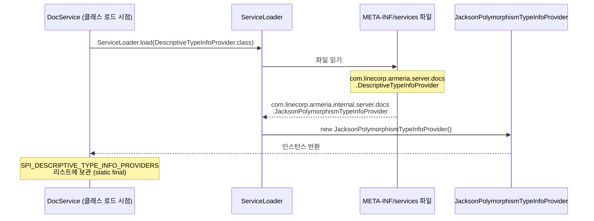
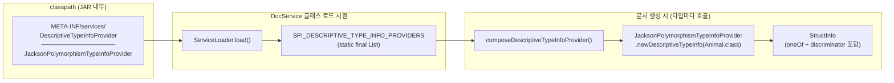

### 지난 포스팅

[Armeria(1): DocService 구조 이해](https://younghoney.github.io/posts/Armeria(1)/)  
[Armeria(3): Jackson 어노테이션으로 다형성 정보 추출하기](https://younghoney.github.io/posts/Armeria(3)/)

지난 포스팅에서 `JacksonPolymorphismTypeInfoProvider`를 만들었다. 하지만 이 클래스를 만들었다고 해서 DocService가 자동으로 사용하지는 않는다. DocService에게 "이런 Provider가 있으니 써라"고 알려줄 방법이 필요하다.

Armeria(1)에서 DocService 코드를 보면서 이런 구절이 있었다.

> "DocService는 Java의 SPI를 이용해 DocServicePlugin과 DescriptiveTypeInfoProvider의 구현체를 읽어오는데, 상당히 흥미로운 기술이라 다음에 기회가 된다면 포스팅할 계획이다."

그 기회가 왔다.

---

### Java SPI란?

SPI(Service Provider Interface)는 Java의 표준 확장 메커니즘이다. 라이브러리 제작자가 **인터페이스만 정의**해두면, 사용자(또는 우리)가 그 인터페이스의 구현체를 **별도 설정 파일**에 등록해두기만 해도 런타임에 자동으로 로드된다.

데이터베이스 드라이버(`java.sql.Driver`), 로깅 프레임워크의 바인딩 등 Java 생태계의 수많은 확장 포인트가 SPI 기반이다.

핵심 메커니즘은 세 가지다.

1. **인터페이스 정의** (Armeria 제공): `DescriptiveTypeInfoProvider`
2. **구현체 작성** (우리가 구현): `JacksonPolymorphismTypeInfoProvider`
3. **등록 파일 작성** (우리가 추가): `META-INF/services/<인터페이스 FQCN>`



---

### META-INF/services 파일 등록

`src/main/resources/META-INF/services/` 디렉터리에 **인터페이스의 완전한 클래스명**으로 파일을 하나 만든다.

```
core/src/main/resources/
└── META-INF/
    └── services/
        └── com.linecorp.armeria.server.docs.DescriptiveTypeInfoProvider  ← 파일명
```

파일 내용은 단 한 줄이다.

```
com.linecorp.armeria.internal.server.docs.JacksonPolymorphismTypeInfoProvider
```

이게 전부다. JVM이 클래스로더를 통해 이 파일을 찾아 읽고, 명시된 클래스를 인스턴스화해서 `ServiceLoader`에게 넘긴다.

---

### DocService는 어떻게 이것을 쓰는가

Armeria(1)에서 이미 살펴본 코드다.

```java
// DocService.java
static final List<DescriptiveTypeInfoProvider> SPI_DESCRIPTIVE_TYPE_INFO_PROVIDERS =
    ImmutableList.copyOf(ServiceLoader.load(
        DescriptiveTypeInfoProvider.class, DocService.class.getClassLoader()));
```

`static final`이므로 DocService 클래스가 로드되는 시점에 SPI를 통해 `JacksonPolymorphismTypeInfoProvider` 인스턴스를 미리 가져와서 리스트에 보관한다.

그리고 실제 문서 생성 과정에서 `composeDescriptiveTypeInfoProvider`가 호출되며 이 리스트를 순회한다.

```java
// DocService.java
private static DescriptiveTypeInfoProvider composeDescriptiveTypeInfoProvider(
        @Nullable DescriptiveTypeInfoProvider descriptiveTypeInfoProvider) {

    return typeDescriptor -> {
        // 1. DocServiceBuilder로 직접 주입한 Provider를 먼저 시도
        if (descriptiveTypeInfoProvider != null) {
            final DescriptiveTypeInfo info =
                    descriptiveTypeInfoProvider.newDescriptiveTypeInfo(typeDescriptor);
            if (info != null) {
                return info;
            }
        }

        // 2. SPI로 로드된 Provider들을 순서대로 시도
        for (DescriptiveTypeInfoProvider provider : SPI_DESCRIPTIVE_TYPE_INFO_PROVIDERS) {
            final DescriptiveTypeInfo info = provider.newDescriptiveTypeInfo(typeDescriptor);
            if (info != null) {
                return info;
            }
        }
        return null;
    };
}
```

우선순위는 **Builder 직접 주입 → SPI 자동 로드** 순이다. `JacksonPolymorphismTypeInfoProvider`는 SPI로 등록했으므로, 사용자가 별도로 Builder에 Provider를 주입하지 않아도 자동으로 작동한다.

---

### 전체 연결 흐름



---

### 사용자 입장에서는

SPI 등록 덕분에 사용자는 아무것도 할 필요가 없다. `@JsonTypeInfo`와 `@JsonSubTypes`가 달린 클래스를 반환하는 API를 만들기만 하면, DocService가 알아서 다형성 정보를 문서에 포함시킨다.

물론 특정 동작을 커스터마이징하거나 오버라이드하고 싶다면 DocServiceBuilder에 직접 Provider를 주입하면 된다.

```java
DocService.builder()
          .descriptiveTypeInfoProvider(myCustomProvider) // SPI보다 우선 적용
          .build();
```

---

### 다음 포스팅 예고

Provider가 정보를 제공하면, 그것을 받아서 실제 JSON Schema로 변환하는 것은 `JsonSchemaGenerator`의 몫이다.

다음 포스팅에서는 코드리뷰 과정에서 JSON Schema의 전체 구조가 어떻게 뒤집혔는지를 이야기한다. 처음에는 메서드마다 model 정의를 중복 생성했는데, 리뷰를 통해 `$defs` 구조로 전면 재설계한 과정이다.
