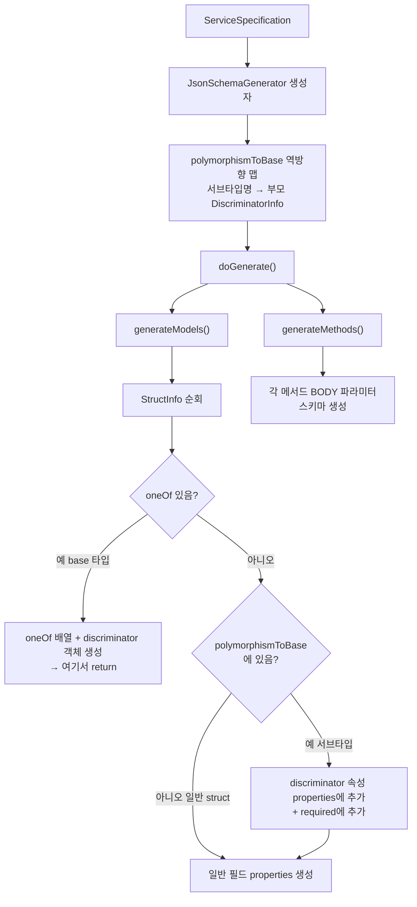

### 지난 포스팅

[Armeria(2): DocService 코드 상세분석](https://younghoney.github.io/posts/Armeria(2)/)  
[Armeria(4): Java SPI로 Provider를 Armeria에 꽂기](https://younghoney.github.io/posts/Armeria(4)/)

지금까지 `JacksonPolymorphismTypeInfoProvider`로 다형성 정보를 추출하고, SPI로 등록하는 것까지 완성했다. 남은 일은 이 정보를 실제 JSON Schema로 변환하는 것이다. Armeria(2)에서 `ServiceSpecification`이라는 최종 산물을 만들어 JSON으로 반환한다고 했는데, 그 JSON 구조를 생성하는 `JsonSchemaGenerator` 이야기다.

---

### 처음 구현: 메서드마다 definitions를 중복 생성

처음 구현에서는 각 메서드의 JSON Schema 안에 필요한 model 정의를 `definitions` 섹션으로 포함시켰다.

```json
{
  "getAnimal": {
    "type": "object",
    "properties": {
      "id": { "type": "integer" }
    },
    "definitions": {
      "com.example.Animal": {
        "oneOf": [
          { "$ref": "#/definitions/com.example.Dog" },
          { "$ref": "#/definitions/com.example.Cat" }
        ]
      },
      "com.example.Dog": {
        "type": "object",
        "properties": { "breed": { "type": "string" } }
      },
      "com.example.Cat": {
        "type": "object",
        "properties": { "isIndoor": { "type": "boolean" } }
      }
    }
  },
  "listAnimals": {
    "type": "object",
    "definitions": {
      "com.example.Animal": { "...": "똑같은 정의가 또!" },
      "com.example.Dog": { "...": "중복!" },
      "com.example.Cat": { "...": "중복!" }
    }
  }
}
```

이 방식은 동작은 하지만 두 가지 문제가 있었다.

1. **중복**: `Animal`, `Dog`, `Cat` 정의가 메서드마다 반복된다. API가 많을수록 JSON 크기가 폭발적으로 늘어난다.
2. **구식 형식**: `definitions`는 JSON Schema draft-04 방식이다. 현행 표준(draft 2020-12)은 `$defs`를 사용한다.

---

### 코드리뷰: 구조를 뒤집어라

minwoox 리뷰어가 이 구조를 지적하며 개선을 요청했다.


_minwoox의 Sep 19 리뷰: 중복 definitions 문제와 `species` 누락을 지적하며 `$defs/methods` + `$defs/models` 구조를 제안했다._


_Sep 23 답변: `JsonSchemaGenerator`를 재작성해 새 구조로 출력되는 JSON을 확인했다._

제안된 구조는 명확했다. 모든 model 정의를 최상위 `$defs.models`로 올리고, 각 메서드는 `$defs.methods`에 모아서 참조로만 연결하자는 것이었다. `definitions`는 JSON Schema draft-04 방식이고, 현행 표준(draft 2020-12)에서는 deprecated되었다는 점도 함께 지적받았다.

---

### After: `$defs` 구조로 전면 재설계

```json
{
  "$schema": "https://json-schema.org/draft/2020-12/schema",
  "$id": "com.example.AnimalService",
  "title": "com.example.AnimalService",
  "$defs": {
    "models": {
      "com.example.Animal": {
        "type": "object",
        "title": "com.example.Animal",
        "oneOf": [
          { "$ref": "#/$defs/models/com.example.Dog" },
          { "$ref": "#/$defs/models/com.example.Cat" }
        ],
        "discriminator": {
          "propertyName": "species",
          "mapping": {
            "dog": "#/$defs/models/com.example.Dog",
            "cat": "#/$defs/models/com.example.Cat"
          }
        }
      },
      "com.example.Dog": {
        "type": "object",
        "title": "com.example.Dog",
        "properties": {
          "species": { "type": "string" },
          "breed": { "type": "string" }
        },
        "required": ["species"]
      },
      "com.example.Cat": {
        "type": "object",
        "title": "com.example.Cat",
        "properties": {
          "species": { "type": "string" },
          "isIndoor": { "type": "boolean" }
        },
        "required": ["species"]
      }
    },
    "methods": {
      "getAnimal": {
        "$id": "com.example.AnimalService/getAnimal",
        "title": "getAnimal",
        "type": "object",
        "additionalProperties": false,
        "properties": {
          "id": { "type": "integer" }
        }
      },
      "listAnimals": {
        "$id": "com.example.AnimalService/listAnimals",
        "title": "listAnimals",
        "type": "object",
        "additionalProperties": false
      }
    }
  }
}
```

주목할 점이 세 가지 있다.

1. `Animal`, `Dog`, `Cat` 정의가 `$defs.models`에 **한 번만** 등장한다.
2. `Dog`와 `Cat`의 `properties`에 `"species": { "type": "string" }`이 **자동으로** 추가되어 있다.
3. `"required": ["species"]`도 **자동으로** 추가된다.

2번과 3번은 따로 명시하지 않았는데 어떻게 들어간 걸까? `polymorphismToBase` 미리계산 덕분이다.

---

### `JsonSchemaGenerator` 구현

#### 최상위 구조 생성: `doGenerate()`

```java
private ObjectNode doGenerate() {
    final ObjectNode root = mapper.createObjectNode();
    final ServiceInfo representativeService = serviceSpecification.services().iterator().next();
    final String serviceName = representativeService.name();

    root.put("$schema", "https://json-schema.org/draft/2020-12/schema");
    root.put("$id", serviceName);
    root.put("title", serviceName);

    final ObjectNode defs = root.putObject("$defs");
    defs.set("models", generateModels());  // 모든 타입 정의
    defs.set("methods", generateMethods()); // 모든 메서드 스키마

    return root;
}
```

`$defs` 아래에 `models`와 `methods` 두 섹션을 만들고 각각 별도 메서드에서 생성한다.

#### models 섹션: `generateModels()`

```java
private ObjectNode generateModels() {
    final ObjectNode modelsNode = mapper.createObjectNode();
    for (final StructInfo structInfo : serviceSpecification.structs()) {
        modelsNode.set(structInfo.name(), generateStructDefinition(structInfo));
    }
    for (final EnumInfo enumInfo : serviceSpecification.enums()) {
        modelsNode.set(enumInfo.name(), generateEnumDefinition(enumInfo));
    }
    return modelsNode;
}
```

`ServiceSpecification`에 수집된 모든 struct와 enum을 순회해 JSON 노드로 변환한다. 메서드가 아무리 많아도 각 모델은 여기서 **한 번만** 정의된다.

#### struct 정의 생성: `generateStructDefinition()`

핵심 로직이 여기 있다.

```java
private ObjectNode generateStructDefinition(StructInfo structInfo) {
    final ObjectNode schemaNode = mapper.createObjectNode();
    schemaNode.put("type", "object");
    schemaNode.put("title", structInfo.name());

    // --- base 타입인 경우: oneOf + discriminator ---
    final List<TypeSignature> oneOf = structInfo.oneOf();
    if (!oneOf.isEmpty()) {
        final ArrayNode oneOfNode = schemaNode.putArray("oneOf");
        oneOf.forEach(sub -> {
            final ObjectNode ref = mapper.createObjectNode();
            ref.put("$ref", "#/$defs/models/" + sub.name());
            oneOfNode.add(ref);
        });

        final DiscriminatorInfo discriminator = structInfo.discriminator();
        if (discriminator != null) {
            final ObjectNode disc = schemaNode.putObject("discriminator");
            disc.put("propertyName", discriminator.propertyName());
            if (!discriminator.mapping().isEmpty()) {
                final ObjectNode mapping = disc.putObject("mapping");
                discriminator.mapping().forEach(mapping::put);
            }
        }
        return schemaNode; // base 타입은 여기서 끝
    }

    // --- 일반 struct 또는 서브타입인 경우 ---
    final ObjectNode props = mapper.createObjectNode();

    // 서브타입이면 discriminator 속성을 자동으로 주입
    final DiscriminatorInfo discriminatorInfo = polymorphismToBase.get(structInfo.name());
    if (discriminatorInfo != null) {
        final ObjectNode propertySchema = props.putObject(discriminatorInfo.propertyName());
        propertySchema.put("type", "string");
    }

    final List<String> requiredFields = new ArrayList<>();
    for (final FieldInfo field : structInfo.fields()) {
        props.set(field.name(), generateFieldSchema(field));
        if (field.requirement() == FieldRequirement.REQUIRED) {
            requiredFields.add(field.name());
        }
    }
    if (!props.isEmpty()) {
        schemaNode.set("properties", props);
    }

    // 서브타입이면 discriminator 속성을 required에도 추가
    if (discriminatorInfo != null) {
        requiredFields.add(discriminatorInfo.propertyName());
    }

    if (!requiredFields.isEmpty()) {
        final ArrayNode requiredNode = mapper.createArrayNode();
        requiredFields.forEach(requiredNode::add);
        schemaNode.set("required", requiredNode);
    }
    return schemaNode;
}
```

`oneOf`가 있는 타입(base 타입)과 없는 타입(일반 struct 또는 subtype)을 분기한다. 서브타입인 경우 `polymorphismToBase`에서 부모의 discriminator 정보를 찾아 해당 속성을 `properties`와 `required` 모두에 자동 삽입한다.

#### `polymorphismToBase` 미리계산

`Dog`나 `Cat` 스키마를 생성할 때 "이 클래스는 누구의 서브타입이고, discriminator가 뭐지?"를 빠르게 알아야 한다. 생성자에서 역방향 맵을 미리 만들어 둔다.

```java
private JsonSchemaGenerator(ServiceSpecification serviceSpecification) {
    // ...
    // alias 맵 (gRPC 등에서 사용하는 이름 별칭)
    final Map<String, String> nameToAlias = new HashMap<>();
    for (final StructInfo struct : serviceSpecification.structs()) {
        if (struct.alias() != null) {
            nameToAlias.put(struct.name(), struct.alias());
        }
    }

    // 역방향 맵: "com.example.Dog" → Animal의 DiscriminatorInfo
    polymorphismToBase = new HashMap<>();
    for (final StructInfo struct : serviceSpecification.structs()) {
        final DiscriminatorInfo discriminator = struct.discriminator();
        if (discriminator != null) {
            struct.oneOf().forEach(sub -> {
                polymorphismToBase.putIfAbsent(sub.name(), discriminator);
                final String alias = nameToAlias.get(sub.name());
                if (alias != null) {
                    polymorphismToBase.putIfAbsent(alias, discriminator);
                }
            });
        }
    }
}
```

`Animal`의 `oneOf`가 `[Dog, Cat]`이고 discriminator가 `species`라면, 이 코드는 다음 맵을 만든다.

```
{
  "com.example.Dog" → DiscriminatorInfo(propertyName="species", mapping={...}),
  "com.example.Cat" → DiscriminatorInfo(propertyName="species", mapping={...})
}
```

이후 `Dog` 스키마를 생성할 때 `polymorphismToBase.get("com.example.Dog")`로 `DiscriminatorInfo`를 즉시 조회해서 `species` 속성을 자동 주입한다.

---

### 전체 생성 흐름



---

### 구현 완료 후 DocService 화면


_PR 이후: `Dog` struct 필드가 완전히 노출되고, 사이드바에 `Cat`, `Dog`, `Toy`, `VetRecord` 등 서브타입이 모두 표시된다._


_PR 이후: `processAnimal()` 메서드 상세 화면_

---

### 정리

PR [#6370](https://github.com/line/armeria/pull/6370)에서 구현한 내용을 정리하면 다음과 같다.

| 컴포넌트 | 역할 |
|---|---|
| `JacksonPolymorphismTypeInfoProvider` | `@JsonTypeInfo` + `@JsonSubTypes` reflection으로 다형성 정보 추출 |
| `DiscriminatorInfo` | discriminator propertyName + mapping 보관하는 불변 데이터 클래스 |
| `StructInfo` (수정) | `oneOf`, `discriminator` 필드 추가 |
| `JsonSchemaGenerator` (재작성) | `$defs: {models, methods}` 구조로 중복 없이 JSON Schema 생성 |
| `META-INF/services` | SPI로 Provider 자동 등록 |

---

### Merge까지의 여정

PR Draft를 올린 것이 2025년 8월이었다. 이후 리뷰 과정이 길었는데, 서버 사이드 구현이 완료된 뒤에도 프론트엔드 연동 작업이 남아 있었다.

2026년 2월, minwoox가 먼저 approve하며 이런 댓글을 남겼다.

> "@YoungHoney Sorry that I'm late. 😆  
> I resolved the conflict and did the UI work.  
> Thanks a lot!"


말대로 conflict를 직접 resolve하고 RequestBody.tsx의 프론트엔드 작업까지 push해줬다. 그 덕분에 `$defs` 구조에 맞는 자동완성이 DocService UI에서도 동작하게 됐다.


jrhee17도 같은 시기에 approve했고,


ikhoon이 2월 27일 최종 approve 후 4월에 merge했다.

**Armeria 1.38.0 릴리즈 노트**에는 다음 한 줄이 들어갔다.

> *DocService now correctly generates JSON Schema with `oneOf` and `discriminator` fields for types annotated with Jackson's `@JsonTypeInfo` and `@JsonSubTypes`. [#6370](https://github.com/line/armeria/pull/6370)*

그리고 릴리즈 페이지의 Thank you 섹션에 contributor로 이름이 올랐다.


_1.38.0 릴리즈 노트에 포함된 PR #6370 한 줄_


_Armeria 1.38.0 릴리즈 페이지의 Thank you 섹션 — 맨 왼쪽 첫 번째 아이콘이 나다._

반년 이상 걸린 여정이었지만, 오픈소스 프로젝트에 실질적인 기능을 기여하고 릴리즈 노트에 이름을 올릴 수 있어서 보람찼다.
